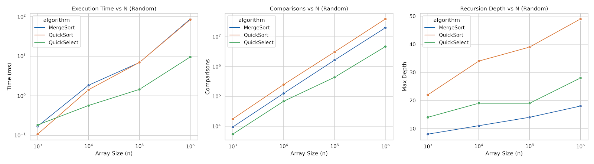

# Assignment 1: Divide and Conquer Algorithms - Report

## 1. Asymptotic Analysis & Master Theorem

### MergeSort
- **Recurrence Relation:** $T(n) = 2T(n/2) + O(n)$
- **Master Theorem Parameters:** $a = 2$, $b = 2$, $f(n) = O(n)$
- **Case Applied:** Case 2 ($f(n) = \Theta(n^{\log_2 2}) = \Theta(n)$)
- **Time Complexity:** $\Theta(n \log n)$[cite: 1]

### QuickSort (Randomized Pivot & 3-way Partition)
- **Recurrence Relation:** $T(n) = 2T(n/2) + O(n)$ (average case)
- **Time Complexity:** $\Theta(n \log n)$ average, $O(n^2)$ worst-case[cite: 1]
- **Justification:** Randomized pivoting guarantees proportional splits in expectation, bounding recursion depth to $O(\log n)$.

### QuickSelect
- **Recurrence Relation:** $T(n) = T(n/2) + O(n)$ (recurse into only one half)[cite: 1]
- **Master Theorem Parameters:** $a = 1$, $b = 2$, $f(n) = O(n)$
- **Case Applied:** Case 3 ($f(n) = \Omega(n^{\log_2 1 + \epsilon}) = \Omega(n^1)$)
- **Time Complexity:** $\Theta(n)$ average[cite: 1]

---

## 2. Benchmark Results & Visualizations

The benchmarks were executed for sizes $n \in \{1000, 10000, 100000, 1000000\}$ across random, sorted, and duplicate-heavy arrays. Median values of 5 runs are recorded in `results.csv`.

### Key Observations:
1. **QuickSelect Efficiency:** Demonstrates significantly lower execution time and fewer comparisons than both sorting algorithms because it partitions only one sub-array instead of two.
2. **Recursion Depth:** `MergeSort` maintains a predictable depth of $\log_2(n)$, whereas `QuickSort` depth scales proportional to $\approx 1.6 \ln(n)$, remaining well within safe stack limits due to tail-recursion optimization.